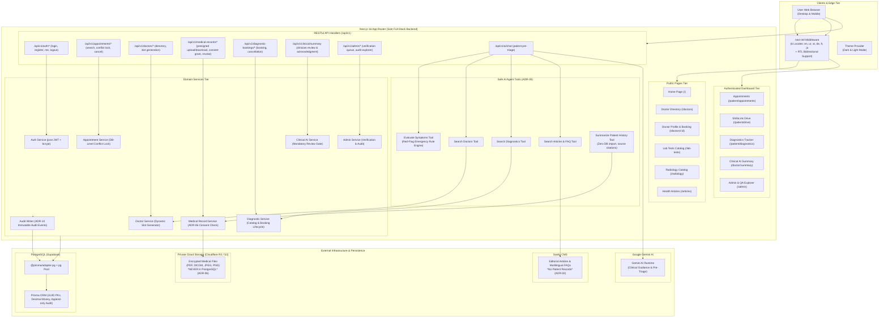

# ShifaLink — System Architecture Diagram & Technical Topology

```mermaid
flowchart TD
    subgraph Clients["Clients & Edge Tier"]
        Browser["User Web Browser\n(Desktop & Mobile)"]
        NextIntl["next-intl Middleware\n(6 Locales: en, ur, ar, de, fr, ja\n+ RTL Bidirectional Support)"]
        Theme["Theme Provider\n(Dark & Light Mode)"]
    end

    subgraph AppRouter["Next.js 16 App Router (Sole Full-Stack Backend)"]
        subgraph PublicPages["Public Pages Tier"]
            Home["Home Page (/)"]
            DocDir["Doctor Directory (/doctors)"]
            DocDetail["Doctor Profile & Booking (/doctors/:id)"]
            LabCat["Lab Tests Catalog (/lab-tests)"]
            RadCat["Radiology Catalog (/radiology)"]
            Articles["Health Articles (/articles)"]
        end

        subgraph DashboardPages["Authenticated Dashboard Tier"]
            PatAppts["Appointments (/patient/appointments)"]
            PatDrive["ShifaLink Drive (/patient/drive)"]
            PatDiags["Diagnostics Tracker (/patient/diagnostics)"]
            DocSummary["Clinical AI Summary (/doctor/summary)"]
            AdminDash["Admin & QA Explorer (/admin)"]
        end

        subgraph ApiTier["RESTful API Handlers (/api/v1)"]
            AuthRoutes["/api/v1/auth/* (login, register, me, logout)"]
            ApptRoutes["/api/v1/appointments/* (search, conflict lock, cancel)"]
            DoctorRoutes["/api/v1/doctors/* (directory, slot generation)"]
            RecordRoutes["/api/v1/medical-records/* (presigned upload/download, consent grant, revoke)"]
            DiagRoutes["/api/v1/diagnostic-bookings/* (booking, cancellation)"]
            ClinicalRoutes["/api/v1/clinical/summary (clinician review & acknowledgment)"]
            AdminRoutes["/api/v1/admin/* (verification queue, audit explorer)"]
            ChatRoutes["/api/v1/ai/chat (patient pre-triage)"]
        end

        subgraph ServiceLayer["Domain Services Tier"]
            AuthService["Auth Service (jose JWT + bcrypt)"]
            DoctorService["Doctor Service (Dynamic Slot Generator)"]
            ApptService["Appointment Service (DB-Level Conflict Lock)"]
            RecordService["Medical Record Service (ADR-06 Consent Check)"]
            DiagService["Diagnostic Service (Catalog & Booking Lifecycle)"]
            ClinicalService["Clinical AI Service (Mandatory Review Gate)"]
            AdminService["Admin Service (Verification & Audit)"]
            AuditWriter["Audit Writer (ADR-10 Immutable Audit Events)"]
        end

        subgraph AiLayer["Safe AI Agent Tools (ADR-05)"]
            TriageTool["Evaluate Symptoms Tool\n(Red-Flag Emergency Rule Engine)"]
            DocSearchTool["Search Doctors Tool"]
            DiagSearchTool["Search Diagnostics Tool"]
            ArticleSearchTool["Search Articles & FAQ Tool"]
            SummarizeHistoryTool["Summarize Patient History Tool\n(Zero DB import, source citations)"]
        end
    end

    subgraph ExternalServices["External Infrastructure & Persistence"]
        subgraph Database["PostgreSQL (Supabase)"]
            PrismaPg["@prisma/adapter-pg + pg Pool"]
            PrismaSchema["Prisma ORM (UUID PKs, Decimal Money, Append-only Audit)"]
        end

        subgraph ObjectStorage["Private Cloud Storage (Cloudflare R2 / S3)"]
            R2Bucket["Encrypted Medical Files\n(PDF, DICOM, JPEG, PNG)\n*NEVER in PostgreSQL* (ADR-06)"]
        end

        subgraph EditorialCMS["Sanity CMS"]
            SanityEditorial["Editorial Articles & Multilingual FAQs\n*No Patient Records* (ADR-02)"]
        end

        subgraph GeminiApi["Google Gemini AI"]
            GeminiModel["Gemini AI Runtime\n(Clinical Guidance & Pre-Triage)"]
        end
    end

    %% Client Interactions
    Browser --> NextIntl --> PublicPages
    Browser --> NextIntl --> DashboardPages
    Browser --> ApiTier

    %% Route to Service
    AuthRoutes --> AuthService
    DoctorRoutes --> DoctorService
    ApptRoutes --> ApptService
    RecordRoutes --> RecordService
    DiagRoutes --> DiagService
    ClinicalRoutes --> ClinicalService
    AdminRoutes --> AdminService
    ChatRoutes --> TriageTool & DocSearchTool & DiagSearchTool & ArticleSearchTool

    %% AI tool calls
    DocSearchTool --> DoctorService
    DiagSearchTool --> DiagService
    ArticleSearchTool --> SanityEditorial
    SummarizeHistoryTool --> RecordService

    %% Services to persistence
    ServiceLayer --> AuditWriter
    AuditWriter --> PrismaPg
    ServiceLayer --> PrismaPg --> PrismaSchema
    RecordService --> R2Bucket
    ChatRoutes --> GeminiModel
```
